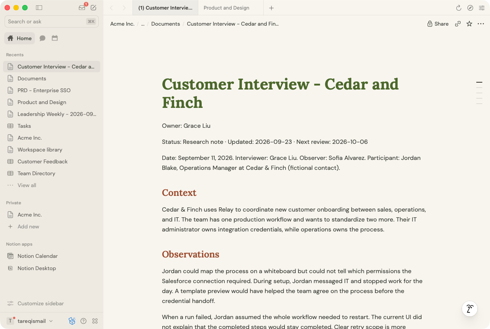
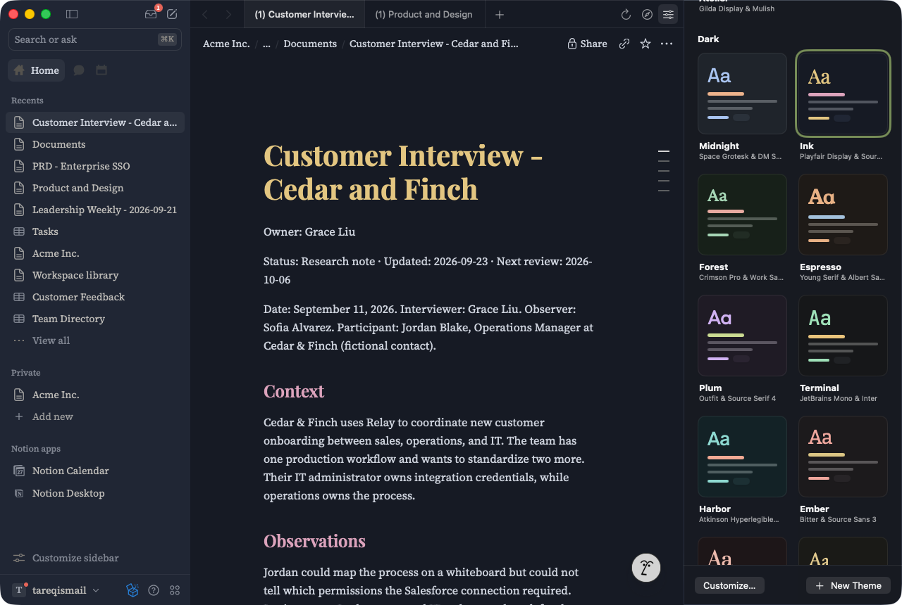
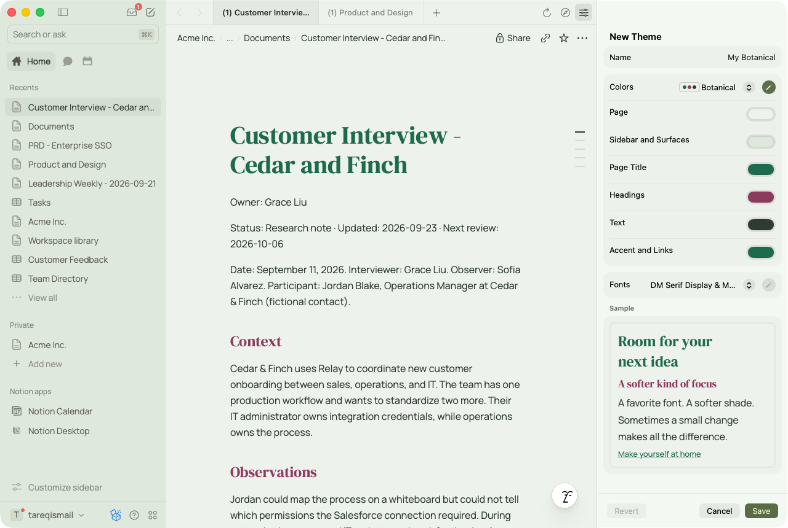

# Potion

A native macOS app for Notion, with quiet color themes and typography you can make your own. Built with SwiftUI, AppKit and WKWebView for macOS 15 or later, with Liquid Glass on macOS 26.

Potion is independent and not affiliated with Notion.



## Download

**[Download Potion for Mac](https://github.com/onepixelaway/potion/releases/latest/download/Potion.dmg)** (macOS 15 or later, Apple silicon and Intel)

Open the disk image and drag Potion into Applications. The app is signed with a Developer ID and notarized by Apple, so it opens with a double-click.

## What you can do

- **Sign in on Notion's own page.** Google, Apple and Microsoft sign-in popups open as a sheet over the window. Later launches reopen your tabs.
- **Work in tabs, laid out like Notion's Mac app.** Notion's sidebar row sits beside the traffic lights, followed by back and forward, your tabs, and reload, open in browser and Appearance. ⌘-click a Notion link to open it in a background tab.
- **Pick a theme** from the Appearance panel: Notion Default plus 24 themes, 14 light and 10 dark. Body text keeps at least 7:1 contrast with the page and sidebar, and titles, headings and links at least 4.5:1. The sidebar keeps Notion's own font unless you turn on **Change sidebar font**.
- **Make your own.** A theme is a color set and a font pairing, and any pairing goes with any palette. The pencil beside each menu opens its individual settings: page and sidebar colors, title, heading, text and link colors, heading and body fonts, text size and line spacing. Edits preview live; Save keeps them in My Themes.
- **Sign out** from the Potion menu or Settings (⌘,). This clears Notion's cookies and website data from Potion.





## Shortcuts

| Shortcut | Action |
| --- | --- |
| ⌘T / ⇧⌘N | New tab / new window |
| ⌘W | Close tab (the window with its last tab) |
| ⇧⌘[ / ⇧⌘] | Previous / next tab |
| ⌘\\ | Show or hide Notion's sidebar |
| ⌘[ / ⌘] | Back / forward |
| ⌘R | Reload |
| ⇧⌘B | Open the page in your browser |
| ⌃⌘I | Show or hide Appearance |
| ⌃⌘1 – ⌃⌘9 | Switch theme (⌃⌘1 is Notion Default) |

Potion's shortcuts stay clear of Notion's own (⌘E, ⌘N, ⌘⌥1–9 and so on), because menu shortcuts would otherwise take them from the page.

## How it works

Each tab is a WKWebView showing Notion's web app. A theme is CSS injected into Notion's pages, along with the theme's two font families embedded from the app bundle, so pages make no font requests. A small page script puts the styles back when Notion replaces the page, and keeps Notion's own font for the sidebar. It also moves Notion's sidebar row into the title bar, and reports the sidebar's width, the inbox count and Notion's own Light or Dark setting so the window matches the page.

Notion and its identity providers render their own sign-in forms, and Potion never reads credentials or exports cookies. The web view identifies as Safari so Google allows sign-in. Themes are injected only into Notion's pages and the offline preview, never into Notion's login page or identity providers, and theme colors and font names are validated before any CSS is generated. Links to other sites open in your default browser, while redirects during sign-in, including enterprise SSO, stay in the window. Preferences are saved in UserDefaults under `com.tareqistyping.potion`.

| Path | What it holds |
| --- | --- |
| `Sources/PotionApp.swift` | App entry, menus and shortcuts, Settings |
| `Sources/AppFlow.swift` | Onboarding stages (welcome → sign in → workspace), sign-out, and each window's Appearance panel state |
| `Sources/RootView.swift` | One window: switches between stages, keeps its tabs' theme in sync, presents sign-in sheets |
| `Sources/Onboarding.swift` | Welcome and sign-in screens |
| `Sources/MainView.swift` | The workspace window: Notion-style header, tabs, and the Appearance panel |
| `Sources/ThemeViews.swift`, `ThemeEditor.swift` | Theme cards and the theme editor |
| `Sources/Tabs.swift` | A window's tabs and their restoration at launch |
| `Sources/Workspace.swift` | One tab's web view: navigation, sign-in popups, downloads, dialogs |
| `Sources/NavigationPolicy.swift` | Which pages load in Potion, open in the browser, or count as signed in |
| `Sources/PotionTheme.swift` | Theme model, the preset collection, the bundled font catalog, saved themes |
| `Sources/ThemeInjection.swift` | The injected CSS and page script |
| `Sources/SharedViews.swift` | Small views and helpers shared across screens |
| `Resources/Fonts` | The 35 bundled font families and their licenses |
| `Resources/Preview.html` | Offline sample page used by the rendering tests |
| `Tests/PotionTests.swift` | Unit tests and WebKit rendering tests |
| `scripts/` | Build and app icon scripts |
| `Screenshots/` | Images for this README |

Notion's markup can change, so the selectors in `ThemeInjection.swift` may need updating. Block colors people choose, media and code fonts are left as they are, and some nested surfaces, such as parts of databases, keep Notion's colors. Passkeys need a browser entitlement and don't work in Potion; use email or another provider. A sign-in popup that starts on an identity provider Potion doesn't list opens in your browser.

## Run

Open `Potion.xcodeproj` in Xcode 26 or later and run the Potion scheme, or build from the command line:

```sh
./scripts/build.sh
open build/Build/Products/Debug/Potion.app
```

`build.sh` first regenerates the Xcode project from `project.yml` with XcodeGen (`brew install xcodegen`). Run `xcodegen generate` yourself after changing `project.yml`.

A build from source has the same bundle identifier as the downloaded app, so the two share preferences, saved themes and your Notion sign-in. Change `PRODUCT_BUNDLE_IDENTIFIER` in `project.yml` to keep them apart.

## Test

```sh
xcodebuild -project Potion.xcodeproj -scheme Potion -configuration Debug -derivedDataPath build CODE_SIGNING_ALLOWED=NO test
```

The tests cover theme validation and saving, the presets' contrast, onboarding and the Appearance panel, tab restoration, navigation and sign-in rules, and real WebKit rendering of themes on the offline preview page. They don't sign in to Notion. Check sign-in, SSO, uploads and downloads by hand with a Notion account.

## Credits

The fonts are from [Google Fonts](https://github.com/google/fonts) and bundled under the SIL Open Font License; each family's license is in `Resources/Fonts`. Some pairings, such as Marcellus with DM Sans and Libre Caslon Display with Jost, come from [Hearten Made](https://heartenmade.com/4-modern-google-font-pairings-youll-love/).

## License

Potion is released under the [MIT License](LICENSE), © 2026 Tareq Ismail. If you build on it, a credit is appreciated.
